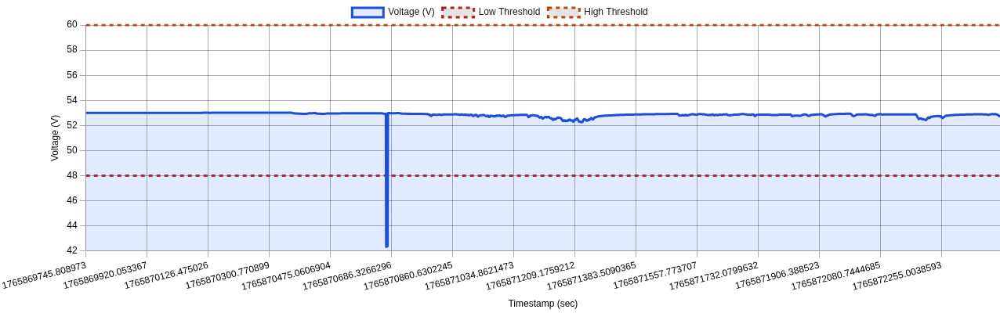
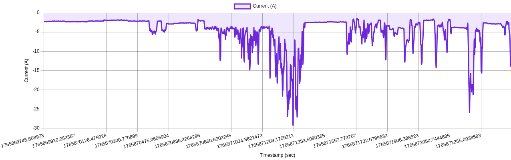
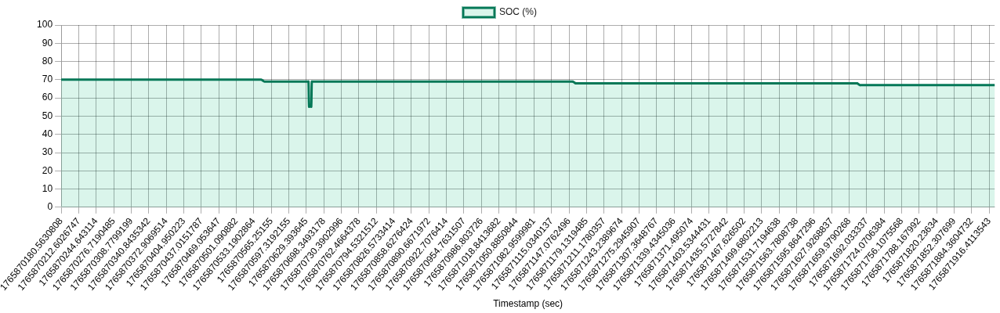
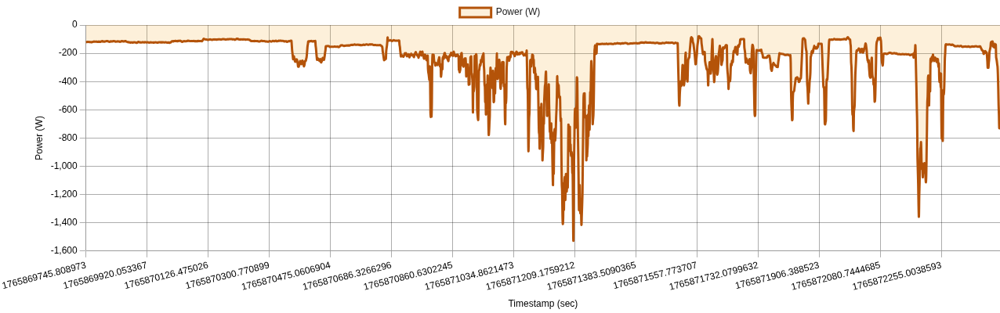
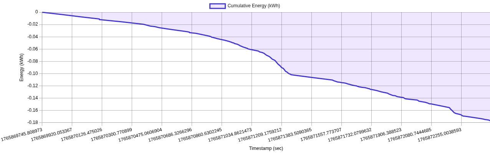
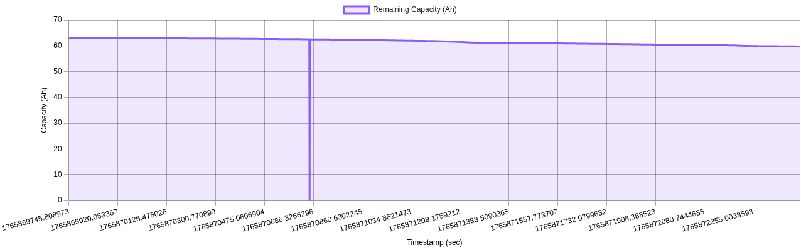
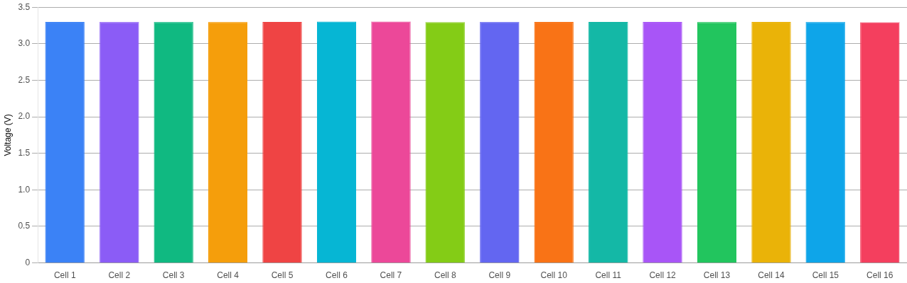
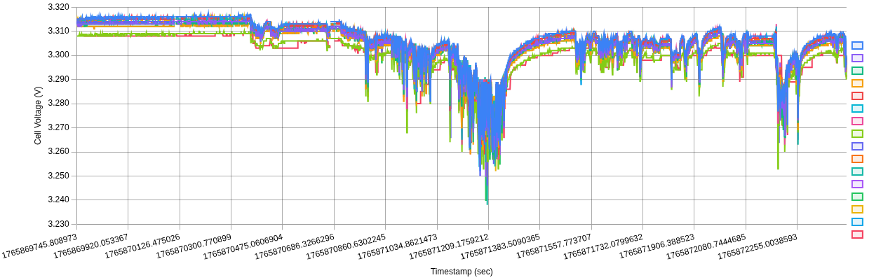
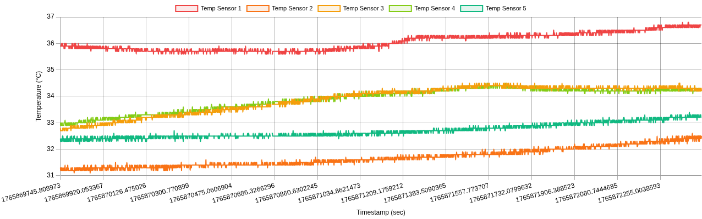
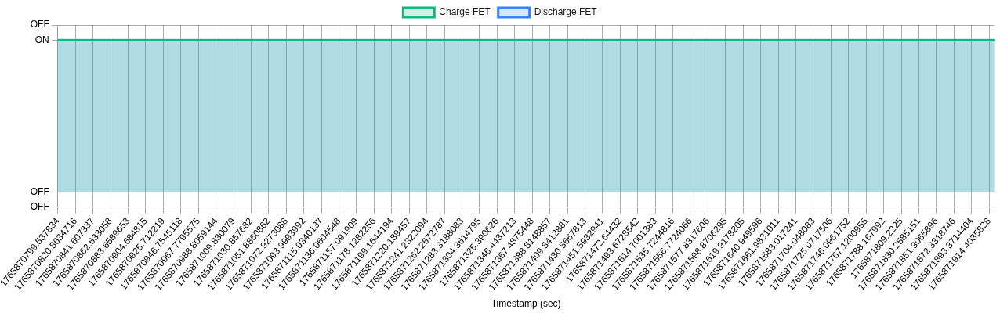

# ⚡ BMS Log Visualizer

A lightweight, browser-based tool to visualize and analyze  
**Battery Management System (BMS) logs** quickly and intuitively.

Designed for engineers who want insights **without writing scripts**.

---

## ✨ Features

- 📄 Parse ROS2-style **YAML BMS logs**
- 📈 Interactive charts for:
  - Voltage
  - Current
  - State of Charge (SOC)
- 🔋 Energy & amp-hour (Ah) calculations
- ⚠️ Threshold visualization
- 📤 Export processed data to CSV
- 🌐 Runs entirely in the browser (no backend)

---

## 🚀 Live Demo

👉 **https://krishnavamsi333.github.io/BMS/**

---

## 🧭 Usage

1. Upload a ROS2-style YAML BMS log file  
2. Explore interactive charts and statistics  
3. Adjust thresholds (if available)  
4. Export processed data as CSV  

---

## 🛠 Tech Stack

- HTML, CSS, JavaScript
- Chart.js
- Client-side YAML parsing

---

## 📌 Use Cases

- Debug BMS behavior
- Validate SOC & energy calculations
- Visual inspection of long log files
- Quick analysis without Python / MATLAB

---

## 📸 Screenshots

  

  

  

  

  

  

  

  

  

  

---

## 🤝 Contributing

Contributions and suggestions are welcome!

---

## 📄 License

MIT License
